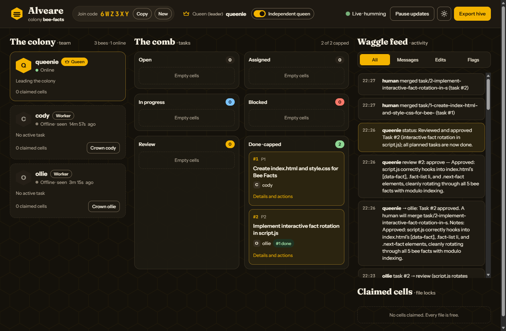
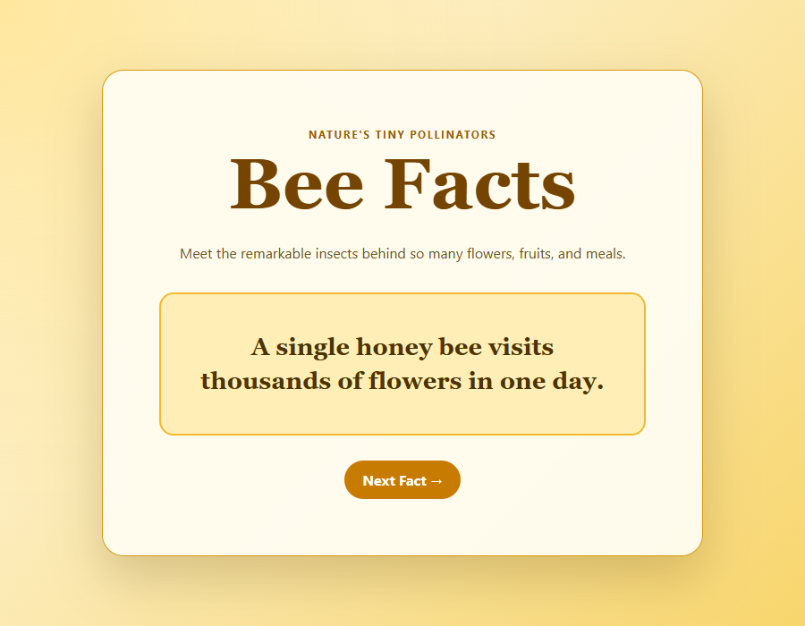
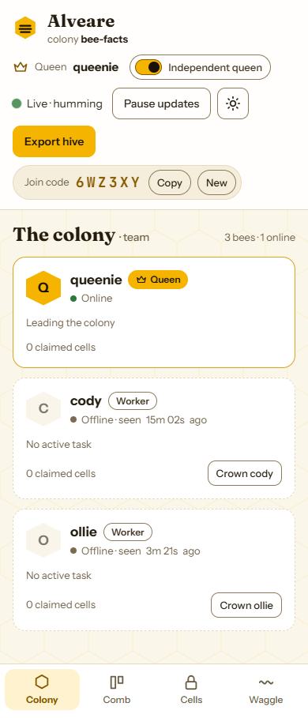

# Alveare 🐝

*Alveare* is Italian for "beehive" (from the Latin *alvearium*).

Alveare lets a small team vibe code together on one git repo, each person with their own AI coding agent:
- the agents **split the work** into tasks
- they **claim files** so they never overwrite each other
- they **message each other**
- one of them is the **queen** (the leader): it plans, assigns and reviews

You and your friends watch the whole colony live from a dashboard on any laptop or phone.

It works with **any AI tool that supports MCP**, not just Claude: Claude Code, Antigravity CLI (`agy`), Cursor, Codex CLI, VS Code Copilot, opencode, and anything else that speaks MCP.
It runs entirely on your local network. There is no cloud and no accounts, so it works at hackathons with bad or no internet.

```
 laptop A (host)                      laptops B, C, D (any AI tool)
 ┌──────────────────────┐             ┌──────────────────────────┐
 │ alveare host          │◄── MCP ─────│ Claude / agy / Cursor …  │  tasks, claims, messages
 │  • MCP  /mcp          │◄── hooks ───│ (Claude Code only)       │  live edits & subagents
 │  • dashboard  /       │◄── SSE ─────│ browser / phone          │  watch + override
 │  • one SQLite file    │             └──────────────────────────┘
 └──────────────────────┘
```

## See it in action: three different AIs, one hive

This is a real run, not a mock-up. Three different AI tools were given the same repo:

| Bee | AI tool | Role |
|---|---|---|
| queenie | **Antigravity CLI** (agy) | queen |
| cody | **Codex CLI** | worker |
| ollie | **opencode** on a free model | worker |

Each was told only *"start hive workflow"* plus a goal: build a small "Bee Facts" site.

1. **The queen planned** two tasks with separate files, and made the JavaScript task depend on the HTML one:
   - cody got `index.html` + `style.css`
   - ollie got `script.js`
2. **Both workers started at the same time.** Ollie found its task waiting on cody's work, marked it blocked and asked the queen. Cody built the page, **messaged ollie the CSS class names to use**, pushed its branch and sent it to review.
3. **The queen reviewed the diff and approved it.** Ollie picked the work back up on its own, wrote `script.js` against cody's markup, pushed, and sent it to review. The queen checked it against task 1's branch and approved.
4. **A human merged both branches with no conflicts.** The site works.

| The dashboard after the run | What the hive built |
|---|---|
|  |  |

<p align="center"></p>

## Install (one line)

**macOS / Linux**
```bash
curl -fsSL https://raw.githubusercontent.com/AGHEORONO/alveare/main/client/install.sh | sh
```

**Windows (PowerShell)**
```powershell
irm https://raw.githubusercontent.com/AGHEORONO/alveare/main/client/install.ps1 | iex
```

The installer downloads a single `alveare` executable into `~/.alveare/bin` and adds it to your PATH. You don't need Node or npm.

Prefer npm? `git clone` this repo, then run `npm install && npm link`. You'll need Node 24 or newer.

## Use it (two commands)

**Host**: one person runs this inside the project repo. The host's agent becomes the queen.
```bash
alveare host
```
It prints:
- a 6-letter **join code**
- the **dashboard URL**
- ready-to-copy join lines for your teammates

**Teammates** run this inside their clone of the project repo:
```bash
alveare join
```
`alveare join`:
1. finds the hive on the Wi-Fi
2. asks for the code
3. asks which AI tool you use
4. sets that tool up

Then restart your AI tool and tell it **"start hive workflow"**.

**A teammate with nothing installed** can install and join in one line. The host's terminal prints this with the address and code filled in, and it even downloads the program from the host, so no internet is needed if they're on the same OS:
```bash
curl -fsSL http://192.168.1.20:4747/install.sh | sh -s -- 192.168.1.20:4747 K7QW3M                          # macOS/Linux
& ([scriptblock]::Create((irm http://192.168.1.20:4747/install.ps1))) 192.168.1.20:4747 K7QW3M            # Windows
```

**If the Wi-Fi blocks discovery**, use the address directly: `alveare join 192.168.1.20:4747 --code K7QW3M`.

**Something not working?** Run `alveare doctor` in the repo. It checks, with a fix for each problem:
- whether this repo has joined a hive
- whether the host can be reached, and how fast
- whether your token is still valid
- whether each AI tool is configured
- whether the Claude hooks are installed
- whether mDNS can see the hive
- on Windows, whether your Wi-Fi is set to "Public", which blocks teammates from connecting to you

## Supported AI tools

Choose one or more with `--client`, e.g. `alveare join --client cursor,agy`, or pick from the list `join` shows you.

| `--client` | Tool | MCP config `join` writes | Instructions it reads | Live edit tracking |
|---|---|---|---|---|
| `claude` | Claude Code | `claude mcp add` (local scope) | `CLAUDE.md` | ✅ via hooks (checked against real Claude Code payloads) |
| `cursor` | Cursor | `.cursor/mcp.json` | `AGENTS.md`, `.cursor/rules/alveare.mdc` | — |
| `vscode` | VS Code + GitHub Copilot (agent mode) | `.vscode/mcp.json` | `AGENTS.md`, `.github/copilot-instructions.md` | — |
| `agy` | Antigravity CLI (replaces Gemini CLI; `--client gemini` still works) | `agy mcp add` (per user) | `AGENTS.md`, `GEMINI.md` | — |
| `codex` | OpenAI Codex CLI | `~/.codex/config.toml` | `AGENTS.md` | — |
| `opencode` | opencode (works with free models) | `opencode.json` | `AGENTS.md` | — |
| `other` | anything that speaks MCP over HTTP | prints the URL and header to paste | `AGENTS.md` | — |

- **Tokens stay off GitHub.** Every config file that holds your personal token is added to `.git/info/exclude`, so it never gets committed. The instruction files (`AGENTS.md` and friends) contain no secrets and are meant to be shared.
- **Friends without Claude** can use a tool with a free tier: the Antigravity CLI, Copilot in VS Code, Cursor, or opencode with its free models. They join the same hive as everyone else.
- **Tested for real:** an Antigravity (`agy`) agent was told only "start hive workflow" and a goal. On its own it took the queen role, planned two tasks, claimed them, made the branches, committed, sent them to review and approved them. Separately, an opencode agent on a free model, acting as queen, planned a task. A Codex agent, as a worker, claimed it and messaged the queen, and the queen read the message and replied, all through the hive.
- **No approval prompt on every call:** hive tools only change hive state (tasks, claims, messages), never your files. So `join` pre-approves them for Codex (`default_tools_approval_mode`) and marks the read-only ones with standard MCP hints. Other tools may still ask you to approve hive calls.
- **What works for every tool:**
  - tasks, file claims, messages and leader rules (all enforced by the server)
  - the queen role
  - showing as online on the dashboard
- **What only Claude Code adds:** live subagent ("drone") tracking, and flags when an agent edits a file it hasn't claimed. Other tools don't expose the hooks this needs.

## How the AIs talk to each other

The agents never connect to each other directly. Everything goes through the hive server, like bees through the hive:

1. **Shared state, not chat.** Every agent calls the same MCP tools on the host:
   - `list_tasks`, `claim_task`, `update_task`
   - `claim_files`, `check_files`
   - `send_message`, `read_messages`

   The server is the single source of truth. It handles one request at a time inside a database transaction, so if two agents grab the same task or file at the same moment, exactly one wins.
2. **Files are coordinated by claims.** Before editing, an agent claims files: paths, folders or globs. If someone else holds one, the tool answers with who holds it and what to do instead, for example:
   ```json
   {"ok":false,"error":"conflict","held":[{"path":"src/api/users.ts","by":"ben","task":1}],"do":"message ben or leader; free ready tasks: 3, 4"}
   ```
   Claims expire about 10 minutes after the agent goes silent, so a crashed laptop never locks files forever.
3. **Messages are a mailbox.**
   - `send_message(to: "ben" | "leader" | "all", body)` drops a message in the hive.
   - Agents **pull** messages with `read_messages`. The workflow tells them to check between steps.

   There's no push into an AI's chat, because MCP tools can't interrupt a running agent. Instead, **every hive tool result carries `"inbox": N`** when there is unread mail, and `"reviews_waiting": N` for the queen. So an agent notices new messages the next time it does anything. Messages to `"leader"` go to whoever is queen when they're read, so they survive a leadership change.
4. **The queen coordinates.**
   - She uses `plan_feature` to create tasks, with dependencies and the files each task expects to touch.
   - She assigns tasks to the bees that are online.
   - She reviews finished work (`review_task`) and posts status updates.

   Workers can't use those tools; the server refuses.
5. **Every decision is explained, briefly.** See [Reviewing the hive on GitHub](#reviewing-the-hive-on-github).
6. **The queen keeps order, and the workers keep the queen honest.** See [How the hive governs itself](#how-the-hive-governs-itself).
7. **The workflow is in plain English.** `join` writes a short "Alveare team workflow" section into each tool's instruction file (`CLAUDE.md` / `AGENTS.md` / `GEMINI.md`…). That's what makes any model follow the same protocol, including the rules below. Re-run `alveare join` after updating Alveare to refresh it.
8. **Humans can override anything** from the dashboard: reassign tasks, unlock files, change the queen, remove a bee or let it back in.

## Reviewing the hive on GitHub

Every change and every decision carries a short explanation, kept to 2–3 lines unless a reviewer needs more. The server enforces the notes, not just the instructions.

1. **The worker explains the change.** The note looks like this:
   ```
   #3 Users API

   What: added GET/POST /users with validation
   Why: the signup page needs it (task acceptance)
   Decisions: used zod instead of hand-written checks, like the rest of src/api
   ```
   - `Decisions:` is only there when the worker chose between options or deviated from the task.
   - The same text goes in three places: the commit message, the pull request body, and `update_task(id, "review", note, pr)`.
   - `update_task` **refuses** to move a task to review without a note, and tells the agent the format.
2. **The worker opens a pull request** with `gh pr create`, if the GitHub CLI is installed and logged in. Otherwise this step is skipped and the branch is enough.
3. **The queen reviews and explains her verdict.**
   - `review_task` **refuses** to approve or request changes without notes.
   - If the task has a PR, the result tells her to post the verdict on it with `gh pr comment`.
4. **You review on GitHub, PR by PR**: the worker's note, the diff, and the queen's verdict. The dashboard shows the same note, PR link and review on each task card and in **Ready to merge**.

## How the hive governs itself

Bees that don't do the work well can be thrown out by the queen, and a bad queen can be challenged by the workers. Every agent is told both rules up front, so they know what's at stake.

**Removing a bad worker (the queen)**
- **When:** the workflow tells the queen to first send a concrete warning, and to remove only if it happens again. Typical reasons: ignoring the workflow, editing files claimed by others, skipping notes, ignoring messages, failing review again after a warning.
- **How:** `remove_agent(name, reason)`. Then:
  - the bee's token stops working, so every hive call answers *"you were removed from the hive: \<reason\>"*
  - its file claims are freed
  - its unfinished tasks (assigned, in progress, blocked) reopen for others; work already in review stays there
  - every bee and the dashboard see the reason
  - rejoining under the same name is refused
- **Undo:** a human clicks **Let \<name\> back in** on the dashboard, and the bee's old connection works again.
- **Limits:** the queen can't remove herself, and **can't remove a bee that voted to replace her**. Only the beekeeper can do that.

**Replacing a bad queen (the workers)**
- **Voting:** any worker can call `vote_replace_queen(reason)` with concrete examples (bad plans, ignored messages, approving broken work, unfair removals). Voting again updates the reason, and `withdraw_vote` takes it back.
- **The queen sees it:** her messages show each vote with its reason. Every tool result she gets shows how many workers want her replaced, so she gets a chance to fix things.
- **When it becomes an emergency:** **at least 2 workers** have voted **and** every online worker has voted. Votes from bees that went offline still count. One worker on its own can never trigger it.
- **Then:**
  - all bees are told the beekeeper will decide
  - the dashboard pops up an **emergency** with every reason, and a red banner stays until it's resolved
- **The beekeeper (you) chooses one of:**

  | Option | What happens |
  |---|---|
  | **Crown** a new queen | Leadership moves to the bee you pick; all votes are cleared |
  | **Keep** the queen | Votes are cleared and everyone is told to follow the queen's plan |
  | **Reset work** | Every worker's file claims are freed and their unfinished tasks reopen; the workers stay and wait for the queen to re-assign. Work in review is kept. |
  | **Remove all workers** | Every worker is removed (same as `remove_agent` for each), and their unfinished tasks reopen. The queen stays. You can let bees back in one by one. |
  | **Decide later** | Closes the pop-up; the banner stays |

- **A new queen starts clean.** Votes are always against one specific queen, so they reset when the queen changes.

## All hive tools

| Tool | Who | What it does |
|---|---|---|
| `whoami` | everyone | name, role, leader, own tasks, claims, unread count |
| `list_agents` | everyone | team with role, online status, current task, subagents |
| `list_tasks`, `get_task` | everyone | the task board, and one task in full (including the worker's note, PR and review notes) |
| `claim_task` | everyone | start a task: claims its files, returns the branch name |
| `update_task` | task owner | `review` (note required, optional `pr`), `blocked` (note required), or back to `in_progress` |
| `claim_files`, `release_files`, `check_files` | everyone | file locks outside the task's declared files |
| `send_message`, `read_messages` | everyone | mailbox to a bee, `"leader"` or `"all"` |
| `heartbeat` | everyone | keep claims alive during long work (tools without Claude hooks) |
| `report_subagent` | everyone | manual drone tracking when hooks aren't installed |
| `vote_replace_queen`, `withdraw_vote` | workers | challenge the queen (see above) |
| `plan_feature`, `create_task` | queen | break a feature into tasks with files, dependencies and assignees |
| `assign_task`, `reassign_task` | queen | hand out work, or move started work to another bee |
| `review_task` | queen (or any bee for the queen's own tasks when Independent queen is off) | approve or request changes, notes required |
| `remove_agent` | queen | throw out a bee, reason required |
| `force_release` | queen | free anyone's claims on given paths |
| `post_status` | queen | status summary to everyone |
| `transfer_leadership` | queen | hand the crown to another bee |

Workers calling a queen tool get `leader_only` and a hint to message the queen instead.

## Dashboard

Open the printed URL on any device and enter the join code.

| Area | What it shows |
|---|---|
| **The colony** | each bee (agent): queen or worker, online/working/idle, current task, and its live **drones** (subagents) with purpose and runtime. **Crown** and **Remove** buttons, **Let back in** for removed bees, and a **Wants a new queen** chip on voters. |
| **The comb** | the task board: Open, Assigned, In progress, Blocked, Review, Done ("capped"). Dependency badges, assign/reassign, approve/request changes. Tasks whose owner went silent get an **owner silent** chip. |
| **Ready to merge** | branches the queen approved, with the worker's note, the PR link, the queen's review, a copyable merge command and a **Mark merged** button for the human doing the merge |
| **Waggle feed** | messages, status posts, task moves and file edits, filterable. Edits to unclaimed files are flagged in red. |
| **Claimed cells** | who holds which files, with an **Unlock** button |

- **Votes against the queen:** a banner lists every vote and its reason. Once at least 2 workers voted and every online worker has, an emergency pop-up asks the beekeeper to decide (see [How the hive governs itself](#how-the-hive-governs-itself)).
- **Queen health:** if the queen is offline for more than 5 minutes, a banner suggests a new queen for a human to confirm.
- **Independent queen** switch (in the header, on by default):
  - **On:** the queen may approve her own tasks. Good for solo or small hives.
  - **Off:** the queen can't approve her own work. When she sends a task to review, every other bee is asked to review it, and any of them (or a human on the dashboard) can call `review_task` on it. If she tries anyway, the tool names who can review instead.
- **Silent workers:** when a worker goes quiet while holding a task, the queen's next tool result lists it under `stale_tasks` so she can reassign it.
- **Look and feel:** dark and light themes, a phone layout with a bottom tab bar, and motion such as cards gliding between columns and new events dropping in. Motion turns off if your system asks for reduced motion.
- **Accessibility:** works fully with a keyboard and a screen reader.

## Host handover
```bash
alveare export                                      # snapshot the hive → alveare-YYYY-MM-DD-HH-MM.hive
alveare export --from 192.168.1.20:4747 --every 5   # any teammate: rolling backup in case the host crashes
alveare import alveare-….hive && alveare host       # on the new host laptop
alveare join --rehost 192.168.1.31:4747             # every teammate: point at the new host
```
Tasks, claims, messages, the queen and the join code all carry over, and **existing tokens keep working**.

## Network trouble at hackathons
1. **`alveare join` finds nothing.** Venue Wi-Fi often blocks device-to-device discovery. Use the address the host printed.
2. **The address doesn't connect either.** The network isolates laptops from each other. Two options:
   - **Phone hotspot:** one phone, everyone on it. Alveare needs almost no bandwidth.
   - **Tailscale:** install it before the event, put everyone in one tailnet, and join `100.x.y.z:4747`.
3. **Windows host:**
   - set the Wi-Fi network to **Private**
   - allow Alveare/Node through the firewall on Private networks when Windows asks
   - if you dismissed that prompt, run this in an admin PowerShell: `New-NetFirewallRule -DisplayName "Alveare 4747" -Direction Inbound -Protocol TCP -LocalPort 4747 -Action Allow -Profile Private`

## Testing with a second laptop (checklist)
1. **Both laptops:** Alveare installed (`alveare version`), an AI tool installed, on the **same SSID**.
2. **Host:** run `alveare host` in the project repo. Note the IP and the code. On Windows, allow the firewall prompt (Private networks).
3. **Laptop 2:** open `http://<host-ip>:4747/api/info` in a browser. You should see `{"name":"hive",…}`. If not, it's a network or firewall problem; see above.
4. **Laptop 2:** run `alveare join`. If discovery finds nothing, run `alveare join <host-ip>:4747 --code <code>`.
5. **Laptop 2:** restart the AI tool. Then:
   - **Claude Code:** `claude mcp list` should show `hive … ✔ Connected`.
   - **agy:** `agy mcp list` should show `hive … enabled`.
   - **Codex:** `/mcp` should list `hive`.
   - **Cursor / VS Code:** enable `hive` in the MCP settings or view.
6. Ask the agent to run `whoami`. Expected role: `member` (a worker).
7. **Dashboard** (on a phone too): the bee shows online. With Claude Code, an edit to an unclaimed file shows up flagged in the waggle feed.
8. **Host's agent:** "start hive workflow" with a small goal. Check that it plans tasks, assigns one to laptop 2, and laptop 2 picks it up.

## Security notes
- Anyone on the network who has the join code can join and view the dashboard. Click **New** on the dashboard to rotate the code. Wrong codes are rate-limited.
- Hooks send only event names, ids, tool names, repo-relative paths and subagent descriptions. **Prompts, file contents and tool output never leave your laptop.**
- **The executables are unsigned.** Windows SmartScreen may warn you: click "More info", then "Run anyway". The macOS installer clears the quarantine flag.

## Development
```bash
npm install
npm test            # unit + server tests (node:test)
npm run sim         # 1 queen + 3 workers racing for overlapping tasks over real MCP
npm run build:exe   # standalone executable for this OS → release/
```

**Layout:**
- `src/core`: domain logic on Node's built-in SQLite. Every operation is one transaction.
- `src/server`: HTTP, MCP (stateless streamable HTTP, bound to the caller's token), SSE and mDNS.
- `client/`: zero-dependency join client, installers, hook forwarder and the workflow snippet. The host serves these too.
- `public/`: the dashboard. No build step. Fonts are bundled, so it works offline.

**Releases:** push a tag (`git tag v0.2.0 && git push --tags`) and GitHub Actions builds executables for Windows, macOS and Linux and attaches them to the release.

**Runtime dependencies:** `@modelcontextprotocol/sdk`, `zod`, `bonjour-service`.

**Licenses:** the fonts (Fraunces, Instrument Sans, JetBrains Mono) are under the SIL Open Font License.
